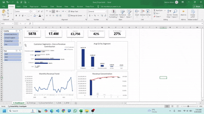
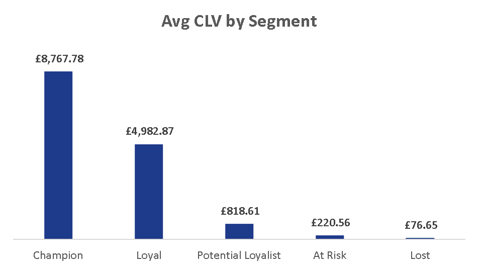

# **E-Commerce RFM Segmentation & Lifetime Value Strategy**

I analyzed £17.3M in UK retail transactions to identify exactly where the business is leaking customer lifetime value. By engineering a custom RFM model and calculating historical CLV, I uncovered a 40x revenue gap between VIPs and at-risk buyers. This analysis provides actionable operational strategies to secure over £630,000 in at-risk revenue through targeted retention and cohort upgrades.

## **Business Question**

Who are our most valuable customers, and exactly how much capital should we allocate to retain them versus acquiring new ones?

## **Key Findings**

* **The 40x VIP Multiplier:** Our top 20% of customers drive 77.2% of total sales. A single "Champion" buyer has a Historical CLV of £8,821—roughly 40 times higher than an "At-Risk" customer (£220).  

  

* **The "Potential Loyalist" Problem:** The largest user segment (33% of the customer base) contributes only 12.8% of revenue. In contrast, the "Loyal" tier makes up a slightly smaller footprint but generates a massive 55.2% of all sales.  
* **Domestic Dependency & Q4 Spikes:** The business is highly localized (82.8% UK revenue) and relies heavily on a massive November acquisition spike. These November sales are driven by first-time holiday shoppers, not existing VIPs spending more.  
* **Category Concentration:** Product lines prefixed with '2' and '8' act as the primary engines for top-line revenue, while several peripheral categories generate negligible financial return.

## **Recommendations**

* **Launch Champion Protection (Defensive):** Trigger personalized account manager outreach if a Champion goes 60 days without a purchase. 

**Impact:** Preventing just a 5% churn in this tier (28 accounts) protects £246,988 in lifetime value that would require acquiring 1,100+ standard At-Risk users to replace.

* **Deploy a "Potential Loyalist" Upgrade Sequence (Growth):** Send an automated 10% discount code exactly 14 days after a first-time delivery to break the "one-and-done" habit.

**Impact:** Upgrading just 5% of this segment (95 users) to Loyal status generates an estimated £389,690 in incremental lifetime revenue.

* **Capitalize on the Q4 Seasonal Trap (Operational):** Insert physical "December-Only" promotional gift cards into every November shipment to convert one-time holiday shoppers into retail buyers. 

**Impact:** Retaining 5% of the unique November cohort (80 users) captures an immediate £65,520 in baseline lifetime value.

## **Limitations**

* **Guest Checkout Blindspot:** Approximately 23% of raw transaction records lacked a Customer ID and were excluded from the RFM model. Total platform revenue is understated, and guest behavioral patterns remain unmapped.  
* **Deterministic CLV & Seasonality Bias:** The CLV metric is a historical heuristic, not a predictive BG/NBD survival model. Additionally, standard RFM logic mathematically penalizes holiday-only shoppers, potentially misclassifying healthy Q4 buyers as "At Risk" during summer months.  
* **Geographic Homogeneity:** With 82.8% of revenue originating in the UK, segmentation behaviors are heavily biased toward the domestic market and should not be blindly generalized to international segments.

## **How to Open and Explore the Analysis**

1. Navigate to the Releases section on the right side of this repository (or click [here](https://github.com/zeeshan-akram-ds/excel-clv-churn-analysis/releases/tag/v1.0.0)) and download the Excel_Project.xlsb asset. (Note: Saved as a Binary file to compress the 50MB+ Power Pivot Data Model).
2. Open in Microsoft Excel (Windows Desktop version recommended for full Power Pivot and Slicer compatibility).  
3. The workbook opens directly to the 3\_Dashboard tab for the executive presentation layer.  
4. Slicers are fully interactive and connected to the backend relational Data Model. To audit the raw mathematics, ETL steps, or EDA, unhide the Dashboard\_Calcs and tbl\_CleanData sheets.

